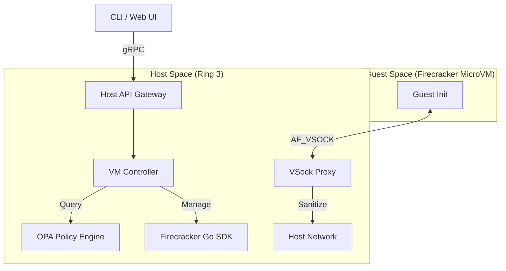

# Enclave

**Enclave** is a Sovereign Security Kernel designed to orchestrate hardware-isolated microVMs for AI agents. It acts as a local hypervisor manager that enforces an "Agentic Constitution" via Policy-as-Code. Primarily consumed by integrations for sandboxed code execution.

> [!NOTE]
> The Enclave orchestrator is dynamically linked with signed, attestable, and digest-verifiable OCI rootfs images to run the secure sandbox.

## Features

- **MicroVM Orchestration**: Uses AWS Firecracker for strong, lightweight isolation.
- **Dependency-Free Host**: 100% Go implementation yielding a single static binary.
- **Zero-Network Policy**: VMs run in a pure airgap. No external network access.
- **VSock Proxying**: All RPC communication is proxied via AF_VSOCK.
- **Policy Engine**: Embedded OPA (Open Policy Agent) validates every action against intent.
- **Auditable Lineage**: Granular lifecycle audit events (`POLICY:*`) emitted with strong cryptographic provenance.

## Installation The Simple Way (TL;DR)

The typical way to run Enclave is via the pre-compiled, verifiable releases. The Enclave binary itself will automatically provision its dependencies (the microVM rootfs, kernel, and Firecracker binary).

### 1. Download & Extract

Download the latest version from the [Releases](https://github.com/tensorpath/enclave/releases) page for your architecture.

```bash
# Example for Linux AMD64
curl -L -o enclave https://github.com/tensorpath/enclave/releases/download/enclave-v1.0.0/enclave_linux_amd64
chmod +x enclave
```

### 2. Run the Orchestrator

When you launch Enclave, it will automatically pull the necessary signed image artifacts and start the hypervisor server.

```bash
# Start host API (listens on :7339)
./enclave up
```

---

## Commands

The `enclave` binary provides a CLI for managing the lifecycle and the local image cache.

- `enclave up`: Start the hypervisor API server.
  - `--cpu=1` / `--mem=2048`: Adjust VM resources.
  - `--provider=auto`: Automatically detect KVM backend (`native`, `lima`, or `wsl2`).
  - `--socket`: Location for the VM socket path.
- `enclave image pull`: Download the latest guest OS images from the TensorPath hub.
- `enclave image verify`: Cryptographically verify downloaded artifacts against attestations.
- `enclave image install`: Load verified artifacts into the local runtime cache (`~/.enclave/cache`).
- `enclave image status`: Check the health and presence of cached microVM assets.

## Architecture



## Security Model

1. **Custom Minimal Init**: PID 1 is a minimal Go stub. No systemd, no shell, no extraneous binaries.
2. **VSock Only**: No virtual network devices (TAP/TUN). The guest cannot reach the host network stack directly.
3. **Least Privilege**: Workloads run as a generic non-privileged user (`uid=1000`).
4. **OPA Gatekeeper**: The Host Proxy checks every RPC request against declarative `rego` boundaries before forwarding them to the VM instance.

---

## Building from Source

For developers modifying the Engine or orchestrator layers, you can build the Enclave binary from source. 

### Prerequisites
- Linux (x86_64 or ARM64)
- Go 1.25+
- KVM access (`/dev/kvm`)

### Build Steps

The build process is fully automated via `build_release.sh` and produces a static host manager.

```bash
# Build host binary (outputs to ./dist)
./build_release.sh

# Start the locally-built binary
./dist/enclave up
```
